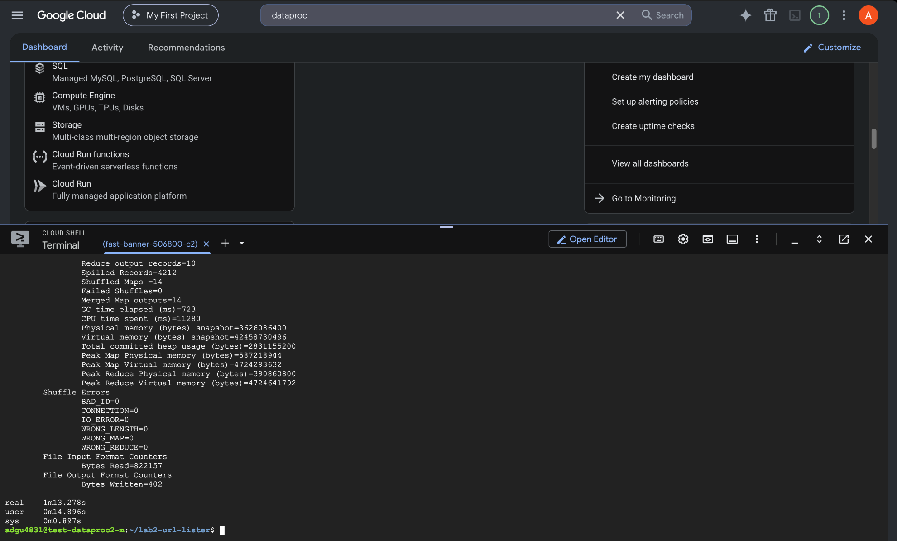
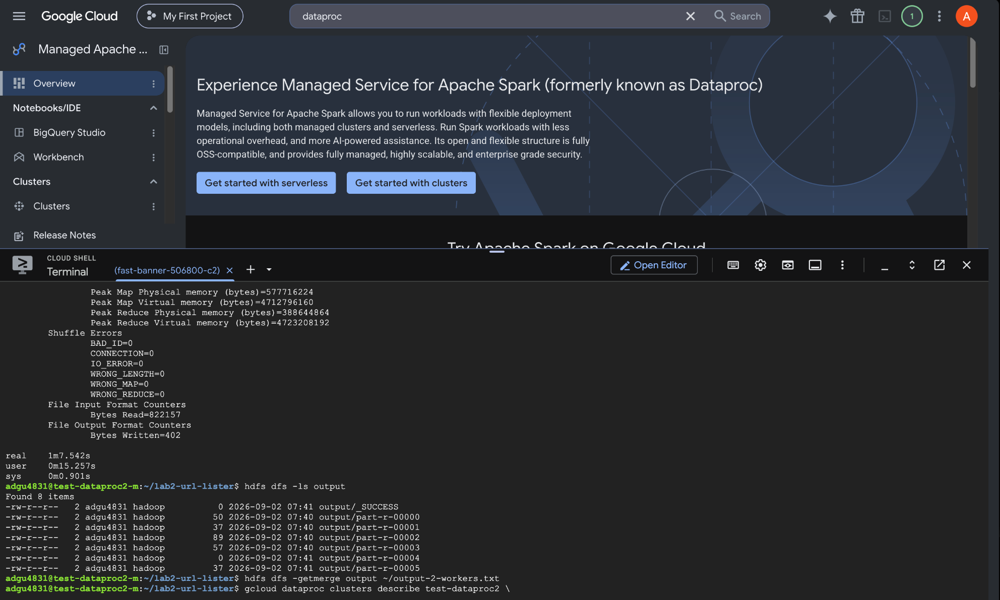

# Lab 2 Solution

## Solution Overview

I implemented the URLCount program using the Hadoop MapReduce Java API. The mapper scans the input HTML for URLs in `href` attributes and emits each URL with a count of `1`. A combiner performs local aggregation of the intermediate counts, and the reducer sums the counts for each URL and writes the URLs that meet the required count threshold.

The program was first tested in the CSEL environment and then run on Google Cloud Dataproc.

## Software Required

The solution requires:

- Java
- Apache Hadoop / Hadoop MapReduce API
- Google Cloud Dataproc
- Git

## Resources and Collaboration

### Resources used:

- Course assignment instructions and course material
- Apache Hadoop documentation
- Google Cloud Dataproc documentation
- Google Cloud `gcloud` documentation

### Collaboration:

Implementation of the task was done in my own individual capacity. I took assistance of ChatGPT mainly for debugging and conceptual doubts.

## How I Ran on Dataproc

For the timing comparison, I used one Dataproc cluster with the following configuration:

- Region: `us-east4`
- Zone: `us-east4-a`
- One master node
- Master machine type: `e2-standard-2`
- Worker machine type: `e2-standard-2`
- Master and worker boot disk size: 50 GB
- 4 workers for the first run, then 2 workers for the second run

The cluster can be created with 4 workers using:

```bash
gcloud dataproc clusters create test-dataproc2 \
    --project=<PROJECT_ID> \
    --region=us-east4 \
    --zone=us-east4-a \
    --master-machine-type=e2-standard-2 \
    --worker-machine-type=e2-standard-2 \
    --master-boot-disk-size=50GB \
    --worker-boot-disk-size=50GB \
    --num-workers=4 \
    --public-ip-address
```

After connecting to the master node and cloning the repository, the input can be prepared with:

```bash
make filesystem
make prepare
```

On Dataproc, I compiled the Java code for Java 11 compatibility and created the JAR with, also updated the Makefile for the same:

```bash
rm -f UrlCount*.class UrlCount.jar
javac --release 11 -classpath "$(hadoop classpath)" -d . UrlCount.java
jar cf UrlCount.jar UrlCount*.class
```

The Hadoop job was run and timed with:

```bash
time hadoop jar UrlCount.jar UrlCount input output
```

Before rerunning the job, the previous HDFS output directory was removed:

```bash
hdfs dfs -rm -r -f output
```

The reducer output files can be combined into one local file with:

```bash
hdfs dfs -getmerge output ~/output-4-workers.txt
```

After completing the 4-worker run, I scaled the same cluster down to 2 workers:

```bash
gcloud dataproc clusters update test-dataproc2 \
    --project=<PROJECT_ID> \
    --region=us-east4 \
    --num-workers=2
```

I then removed the previous output directory and ran the same Hadoop command again. Using the same cluster allowed the machine type, disk size, software environment, code, and HDFS input to remain consistent across the two runs.

## Dataproc Notes

Two main setup issues were encountered. The program was initially compiled for Java 17, while the Dataproc Hadoop runtime used Java 11, so the program was recompiled using `javac --release 11`.

When trying to up-scale to 4 workers, default Dataproc disk allocation exceeded the project's available disk quota, so I had to create cluster with 50 GB boot disks for the master and worker nodes. In order to maintain the data and config consistency I decided to scale down and run 2 worker again.

## Output

The output contained 10 URL/count pairs. A sample from the distributed run was:

```text
#                                                       18
https://en.wikipedia.org/wiki/Doi_(identifier)          18
https://en.wikipedia.org/wiki/ISBN_(identifier)         18
https://en.wikipedia.org/wiki/MapReduce                 6
mw-data:TemplateStyles:r1333433106                      121
```

The same input data was used for both the 2-worker and 4-worker runs.


## Execution-Time Comparison

### 4 Workers

The 4-worker run produced the following timing:

```text
real    1m13.278s
user    0m14.896s
sys     0m0.897s
```

Real execution time: **73.278 seconds**



### 2 Workers

After the same cluster was scaled down to 2 workers, the run produced:

```text
real    1m7.542s
user    0m15.257s
sys     0m0.901s
```

Real execution time: **67.542 seconds**



### Comparison

| Cluster | Real execution time |
| --- | ---: |
| 1 master + 2 workers | 67.542 s |
| 1 master + 4 workers | 73.278 s |

The 2-worker run was **5.736 seconds faster** than the 4-worker run. This was somewhat surprising because increasing the number of workers from two to four did not reduce the real execution time. A likely reason is that the input for this assignment is small, so the additional workers did not provide enough benefit to reduce the total execution time and on top of that, additional scheduling and coordination overhead may have caused the 4-worker cluster to perform similarly to or even slower than the 2-worker cluster.


